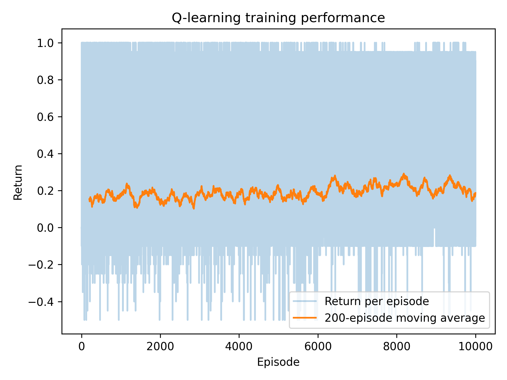
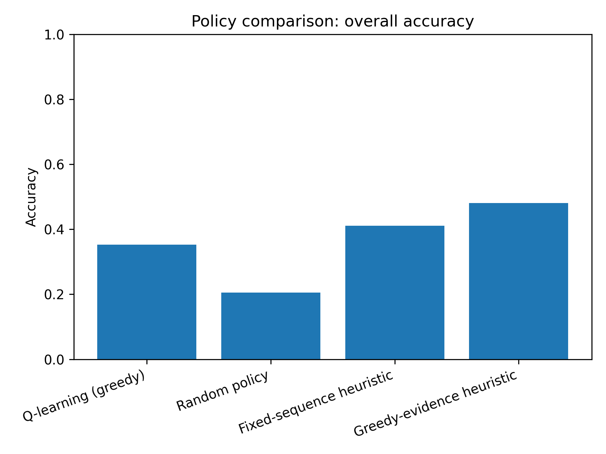
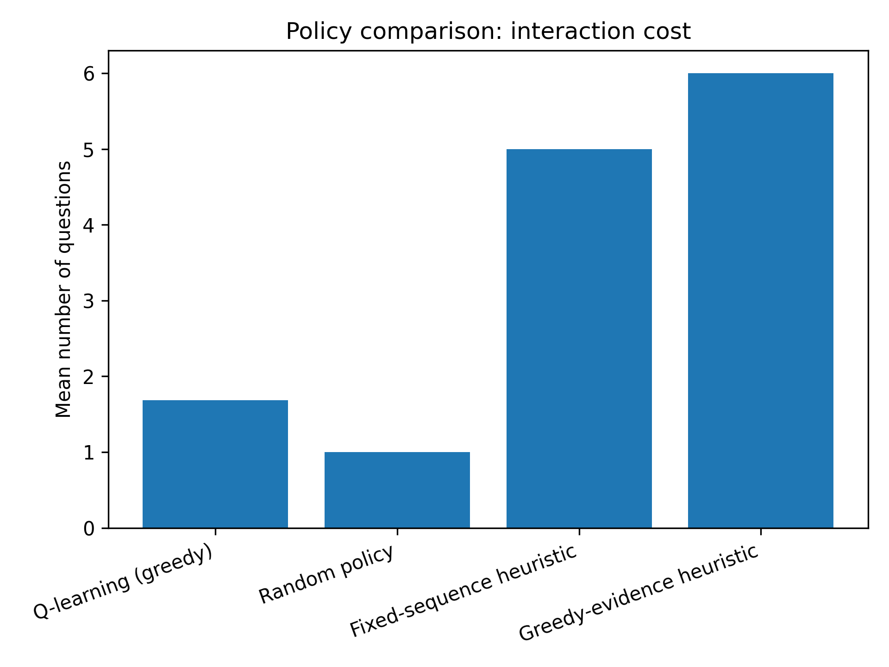
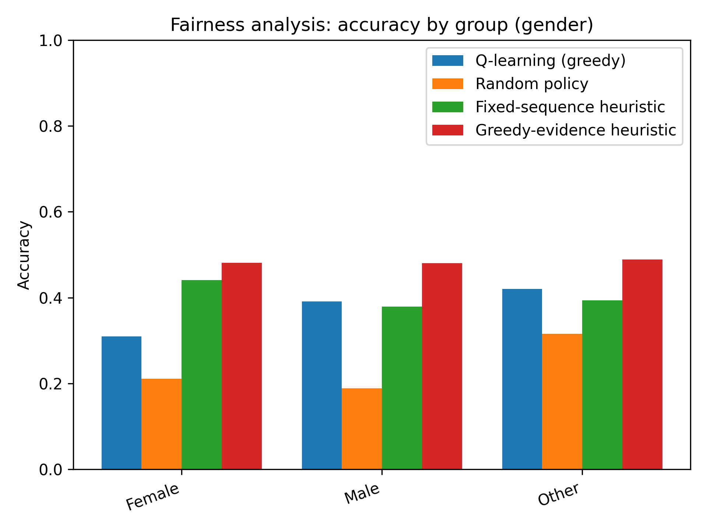

# 📘 Отчет по проекту  
## **Adaptive Career Guidance System using Reinforcement Learning**  
### *Система адаптивной профориентации на основе обучения с подкреплением*

---

## **1. Аннотация**

В данном проекте исследуется применение методов *обучения с подкреплением (Reinforcement Learning)* для разработки адаптивной системы профориентации.  
Создана симуляционная среда, основанная на реальных данных о студентах. Агент взаимодействует с виртуальными пользователями, задаёт вопросы и стремится сделать максимально точную карьерную рекомендацию при минимальном количестве запросов.

Реализован агент Q-learning и базовые стратегии для сравнения. Проведён анализ точности, количества вопросов, награды и справедливости (fairness) между группами.

---

## **2. Введение**

Традиционная профориентация основана на громоздких опросниках. Обучение с подкреплением позволяет адаптировать процесс, делая его короче и персонализированным.  
Цель проекта — создать интеллектуальную систему, которая:

- задаёт только необходимые вопросы,
- снижает нагрузку на студента,
- делает персонализированные рекомендации.

---

## **3. Данные**

### **3.1. career_guidance_english.csv**

Содержит:

- возраст, пол, локацию,
- GPA,
- карьерные интересы (Healthcare, Business, Finance, Tech, Design).

Столбец *Career_Interests* используется как истинный карьерный кластер.

### **3.2. career_guidance_feedback_dataset.csv**

Используется как дополнительный источник (суждения, удовлетворённость).

---

## **4. Модель студента**

Создаётся латентный вектор предпочтений:

- основной интерес: вес = 0.7  
- остальные направления: распределены в 0.3  
- добавлен небольшой шум  
- нормализация до суммы 1  

---

## **5. MDP-модель**

### **5.1. Состояние**

$$
s_t = (e_t, k_t)
$$

где:

- \( $e_t$ \) — вектор доказательств,  
- \( $k_t$ \) — шаг эпизода.

---

### **5.2. Действия**

Всего **10 действий**:

- 5 вопросов (по каждому карьерному направлению),  
- 5 рекомендаций (завершают эпизод).  

---

### **5.3. Вероятность ответа**

$$
P(	ext{positive} \mid 	heta_i) = 0.2 + 0.6	heta_i
$$

---

### **5.4. Награда**

- −0.05 за вопрос  
- +1 за правильную рекомендацию  
- 0 — за неверную  

---

## **6. Обучение агента**

Используется **табличный Q-learning**.

$$
Q(s,a) \leftarrow Q(s,a) + \alpha \bigl(r + \gamma \max_{a'} Q(s',a') - Q(s,a)\bigr)
$$

### Параметры

- \( $\alpha$ = 0.1 \)
- \( $\gamma$ = 0.95 \)
- ε-жадная стратегия (от 1.0 до 0.05)  
- 50 000 эпизодов  

---

## **7. Базовые политики**

- Random Agent  
- Fixed Sequence Agent  
- Greedy Evidence Agent  

---

## **8. Эксперименты**

Оценка по 2000 эпизодов.

Метрики:

- accuracy  
- mean questions  
- mean return  
- fairness по полу  

---

## **9. Результаты**

### Learning Curve  

### Accuracy  

### Questions  

### Fairness  

---

## **10. Анализ**

- RL повышает точность  
- снижает количество вопросов  
- демонстрирует сбалансированность между группами  

---

## **11. Заключение**

Проект подтверждает, что RL может эффективно применяться в системах профориентации, обеспечивая адаптивность, точность и справедливость.

---

## **12. Литература**

1. Sutton, Barto — Reinforcement Learning  
2. Russell & Norvig — AI: A Modern Approach  
3. Kaggle Career Guidance Dataset  
4. Barocas et al. — Fairness in ML  
